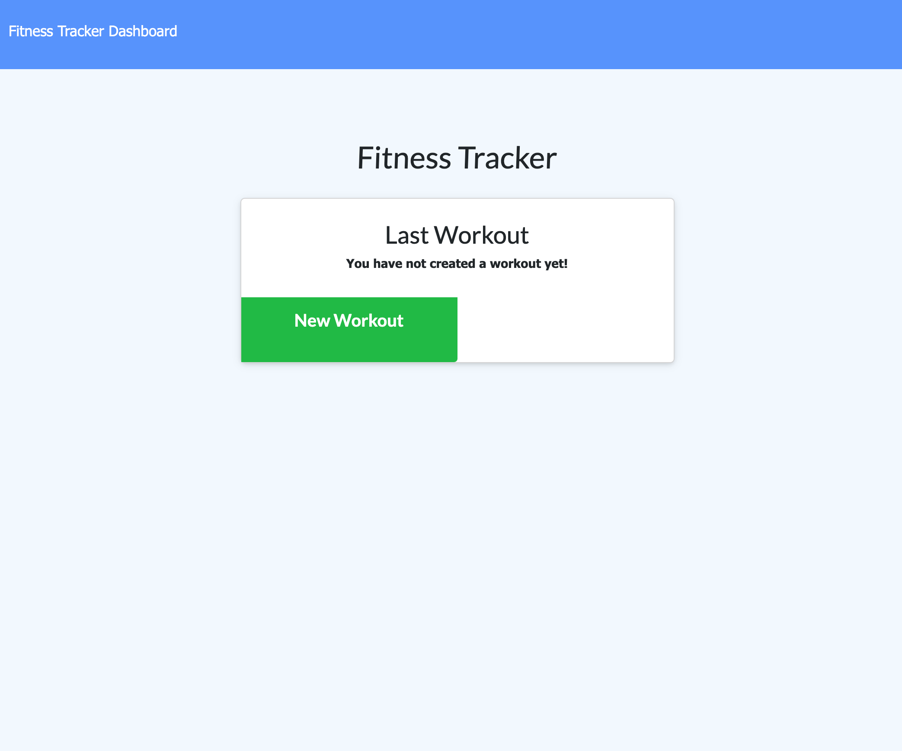

# workout-tracker

- [workout-tracker](#workout-tracker)
  - [INTRODUCTIONS](#introductions)
  - [LINKS](#links)
  - [USAGE](#usage)
  - [CONTRIBUTIONS](#contributions)
  - [CREDITS](#credits)
  - [LICENSE](#license)
  - [SCREENSHOTS](#screenshots)

## INTRODUCTIONS

This is a small fitness tracker app that will let you keep track of your workouts and puts everything into a neat graph to view your progress!

## LINKS

- [WebApp](https://rocky-harbor-45616.herokuapp.com/)
- [GitHub](https://github.com/sksmejn)

## USAGE

Simply head over to [site](https://rocky-harbor-45616.herokuapp.com/) and add an exercise to get started!

## CONTRIBUTIONS

Opened to suggestions!

## CREDITS

Everyone that was invovled in this!

## LICENSE

## SCREENSHOTS

